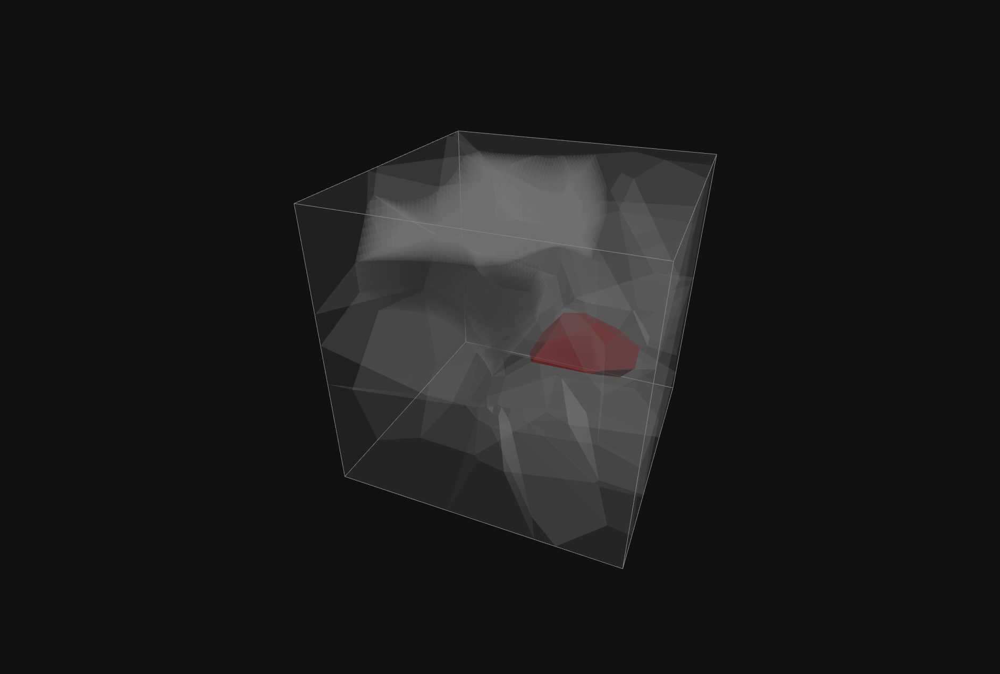

# Voro-js Examples

<table>
  <tr>
    <td align="center">
      <a href="https://mdt-re.github.io/voro-js/examples/moving_cell.html">
        <br />
        <b>Moving Cell</b>
      </a>
    </td>
    <td align="center">
      <a href="https://mdt-re.github.io/voro-js/examples/single_cell.html">
        <br />
        <b>Single Cell</b>
      </a>
    </td>
    <td align="center">
      <a href="https://mdt-re.github.io/voro-js/examples/voronoi_relaxation.html">
        <br />
        <b>Voronoi Relaxation</b>
      </a>
    </td>
  </tr>
</table>

## Running Locally

Due to browser security restrictions regarding WebAssembly and ES modules (CORS), you cannot simply open the HTML files directly from your file system, you must serve them over HTTP. Ensure you have built the project to generate the `dist/` folder containing the WebAssembly and JS bindings. Then start static file server (for example `http-server` via `npx`):
```bash
npm install
npm run build
npx http-server
```
Open your browser and navigate to the respective example: `http://localhost:8080/examples/<example>.html`.

## Deploying to GitHub Pages

These examples are designed to work on GitHub Pages. An `index.html` file is included in this directory to serve as a landing page for the examples. To deploy, you need to activate the `.github/workflows/deploy.yml` by:
    *   Go to the repository on GitHub.
    *   Navigate to **Settings** > **Pages**.
    *   Under **Build and deployment** > **Source**, select **GitHub Actions**.
Once deployed, your examples will be available at `https://<username>.github.io/<repo-name>/examples/`.
